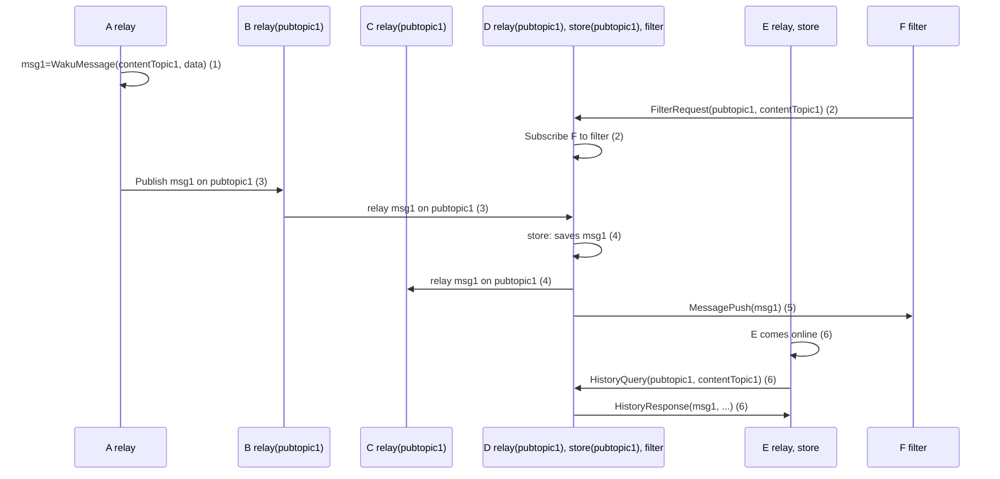

Waku is a unified and cohesive entity that offers a rich ecosystem with three distinct network interaction domains. These domains serve specialized purposes and contribute to the robust functionality of Waku, forming its foundation.

## Discovery Domain

Peer discovery in Waku facilitates locating other nodes within the network. As a modular protocol, Waku incorporates various discovery mechanisms, such as [Discv5](/getting-started/concepts/peer-discovery#discv5) and [Peer Exchange](/getting-started/concepts/peer-discovery#peer-exchange). These mechanisms allow developers to choose the most suitable option(s) for their specific use cases and user environments, including mobile phones, desktop browsers, servers, and more.

## Gossip Domain

GossipSub derives its name from the practice within Pub/Sub networks where peers gossip about the messages they have encountered, thus establishing a message delivery network.

Waku employs gossiping through [Relay](/getting-started/concepts/protocols#relay) to distribute messages across the network. Additionally, Waku introduces [RLN Relay](/getting-started/concepts/protocols#rln-relay), an experimental mechanism that combines privacy preservation and economic spam protection.

## Request/Response Domain

Waku provides a set of protocols to optimize its performance in resource-limited environments like low bandwidth or mostly offline scenarios for multiple purposes.

- [Store](/getting-started/concepts/protocols#store) enables the retrieval of historical messages.
- [Filter](/getting-started/concepts/protocols#filter) efficiently retrieves a subset of messages to conserve bandwidth.
- [Light Push](/getting-started/concepts/protocols#light-push) facilitates message publication for nodes with limited bandwidth and short connection windows.

## Overview of Protocol Interaction

Here's a diagram illustrating the interaction between different protocols within the Waku network.

The Pub/Sub topic `pubtopic1` serves as a means of routing messages (the network employs a default Pub/Sub topic) and indicates that it is subscribed to messages on that topic for a relay. Node D serves as a `Store` and is responsible for persisting messages.

1. Node A creates a WakuMessage `msg1` with [Content Topic](/getting-started/concepts/content-topics) `contentTopic1`.
2. Node F requests to get messages filtered by Pub/Sub topic `pubtopic1` and Content Topic `contentTopic1`. Node D subscribes F to this filter and will forward messages that match that filter in the future.
3. Node A publishes `msg1` on `pubtopic1`. The message is sent from Node A to Node B and then forwarded to Node D.
4. Node D, upon receiving `msg1` both stores the message for future retrieval by other nodes and forwards it to Node C.
5. Node D also pushes `msg1` to Node F, informing it about the arrival of a new message.
6. At a later time, Node E comes online and requests messages matching `pubtopic1` and `contentTopic1` from Node D. Node D responds with `msg1` and potentially other messages that match the query.
