`Waku v1` was a fork of Whisper with some added tweaks for efficiency. `Waku v2` introduces a fully revamped suite of protocols designed to address the goals set out [previously](/#motivation-and-goals).

```mermaid
%%{init: { 'logLevel': 'debug', 'theme': 'base', 'gitGraph': {'showBranches': true, 'showCommitLabel':true,'mainBranchName': 'HISTORY'}} }%%
gitGraph
    commit id:"2013"
    commit id:"2015" tag:"R&D"
    commit id:"2018" tag:"R&D" type: HIGHLIGHT
    branch v1
    checkout v1
    commit id:"2020" tag:"release"
    checkout HISTORY
    merge v1
    branch v2
    checkout v2
    commit id:"2021" tag:"release"
    checkout HISTORY
    merge v2
    commit id:"🔥"
```

### 2013

The Ethereum White Paper was published, unveiling the holy trinity of Web3, comprising:

- Ethereum for consensus.
- Swarm for decentralized storage.
- Whisper for peer-to-peer messaging.

### 2015-2018

The development of the Whisper protocol lagged behind the advancements made by the Ethereum EVM and Swarm, primarily because there was no dedicated team working on building the protocol.

### 2018

Due to the lack of progress made on Whisper and growing concerns around scalability, [Vac](https://vac.dev/) was established to focus on researching and developing more scalable peer-to-peer messaging solutions.

### 2020

`Waku v1` replaces Whisper as the messaging protocol in Status, resulting in the following:

- Enhanced performance.
- Better scalability.
- Ability to work in resource-limited environments.
- And many more.

### 2021

`Waku v2` releases with a fully revamped suite of protocols that not only supersedes but also surpasses the performance of `Waku v1`.

### Present Day

Waku has continued to evolve and enhance itself, solidifying its position as the standard for Web3 communication.
